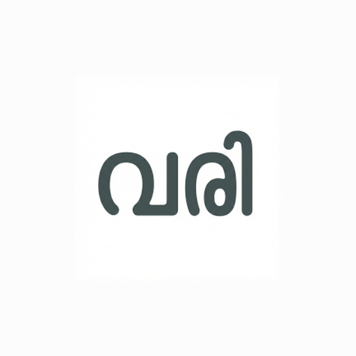

# Launcher icon — Hora-family wordmark (derived from the Varisankya reference)

Every Hora app's launcher icon is the app's short name as a Malayalam **wordmark**,
drawn to match one canonical reference: **Varisankya's "വരി"**, ratified by the owner as
the family gold standard. This folder holds that reference and the exact metrics every
app's icon must hit. The step-by-step generation *procedure* lives in the
[`hora-launcher-icon`](../../.github/skills/hora-launcher-icon/SKILL.md) agent skill —
**this doc is the reference + target metrics that procedure is measured against.**

## The canonical reference (in this folder)

- **`varisankya-vari-reference.xml`** — the hand-authored vector of "വരി" (three glyphs:
  വ · ര · ി), lifted verbatim from Varisankya's shipped `ic_launcher_monochrome.xml`.
  This is the source of truth for shape, weight, and proportion — it is **hand-authored,
  not a font dump**. Graft shared subglyphs (e.g. the ി vowel sign) verbatim from here.
- **`varisankya-vari-reference.png`** — rendered preview in the family colours.

## Family constants — identical for every app

| Property | Value |
| --- | --- |
| Glyph colour | **`#445353`** (slate) |
| Background | **`#FCFCFC`** (near-white) |
| Type face | **Baloo 2 Bold** — rounded, bold. A monoline face (Manjari) was tried and rejected on sight. |
| Construction | hand-composed **per letter**, not a shaped font string (engines mis-shape complex Malayalam) |

## Target metrics — measured from the reference

Measured off the authored vector (viewport 432) and the shipped xxxhdpi foreground
(cap-height H ≈ 102–105 px). These are the numbers a new app's wordmark must match:

| Metric | Reference value | Why it matters |
| --- | --- | --- |
| **Stem / stroke weight** | **≈ 13 % of cap-height** (measured 12.7–13.7 %, ~13 px at H≈102) | The single biggest quality knob. Baloo 2 Bold's *natural* stem is heavier — **trim it down to ~13 %** with uniform erosion (not directional), or the glyph reads too fat and "off-family". |
| **Bounding-circle fraction** | **R_FRAC ≈ 0.245–0.25** (wordmark half-diagonal ÷ icon size) | Sets fill-vs-padding inside the adaptive mask. Fit the wordmark to a centred circle of this radius so every app has the same visual weight in the launcher tray. |
| **Optical centring** | glyph centre ≈ icon centre (within ~1 %) | Wordmark sits centred in the adaptive safe zone (measured centre (212,210) in a 432 box). |
| **Aspect (Varisankya-specific)** | W:H ≈ **1.80** | True for "വരി" (3 glyphs) only. Other apps have a different letter count, so **don't copy 1.80** — instead fit *your* wordmark to the R_FRAC circle + centring above; the aspect falls out of that. |

> **Provenance (original generator constants, preserved here so they don't age out):**
> the first Varisankya generator recorded `Vstem 121 @ 600px`, `R_FRAC 0.2454`,
> `aspect 1.80`. Independent re-measurement of the shipped icon confirms aspect (1.795)
> and R_FRAC (~0.2495); the `Vstem 121 @ 600px` figure is a working-canvas number from
> that gen (interpret against its own 600 px render, not the final cap-height — the
> *final* shipped stem is the ~13 % above). The generator scripts themselves were never
> in a shared repo; this table is now their durable home.

## How the icon is derived

Follow the seven steps in the **`hora-launcher-icon`** skill. In brief, with the
reference values plugged in:

1. **Graft any shared subglyph verbatim** from `varisankya-vari-reference.xml` (parse the
   path, extract the shared subpath — e.g. the ി i-matra) so it stays pixel-identical.
2. **Render each letter separately** in **Baloo 2 Bold** via a complex-script-aware path
   (not Pillow's basic text), controlling the inter-letter gap manually.
3. **Trim stem weight to ~13 % of cap-height** by *uniform* erosion (shrinks bowls too,
   so it actually reads thinner).
4. **Match cap-height, then compress width to fit the R_FRAC ≈ 0.25 centred circle**;
   restore weight lost to compression with **horizontal-only** dilation.
5. **Assemble with the inter-letter gap added *after* the weight-restore** (before, and
   compression collapses it into a collision). Keep grafted subglyphs out of compression.
6. **Contour-smooth the hi-res master before downsampling** (Gaussian blur + re-threshold
   at 50 % alpha) — the horizontal-only restore leaves flat "tab/spike" ledges on vertical
   stems that otherwise survive the per-density downsample as pixel spikes.
7. **Generate the full mipmap set** (`ic_launcher`, `_foreground`, `_round`, + monochrome
   `drawable`) sized by the R_FRAC fraction, so fill/padding matches the reference.

## Per app (Pathivu and future siblings)

- Your wordmark is **your app's short name** in Malayalam — only the letters change.
- Reuse the **family constants** and **target metrics** above verbatim.
- Graft any letterform you share with "വരി" from the reference vector (don't redraw it).
- Render a **side-by-side against `varisankya-vari-reference.png`** and get **explicit
  owner sign-off before shipping** — this icon is heavily scrutinised — then ship via
  `hora-app-release`.

## Quality bar (what makes the reference "up to the mark")

- **Even stem weight across every letter** — no letter visibly heavier than its neighbour.
- **Rounded Baloo terminals**; no flat or clipped stroke ends.
- **Clean stem edges** — no `dilate_h` tabs/spikes (step 6 smoothing did its job).
- **Correct fill inside the adaptive mask** (R_FRAC), optically centred.
- Reads unmistakably as the **same family** as "വരി" at a glance, at launcher size.
