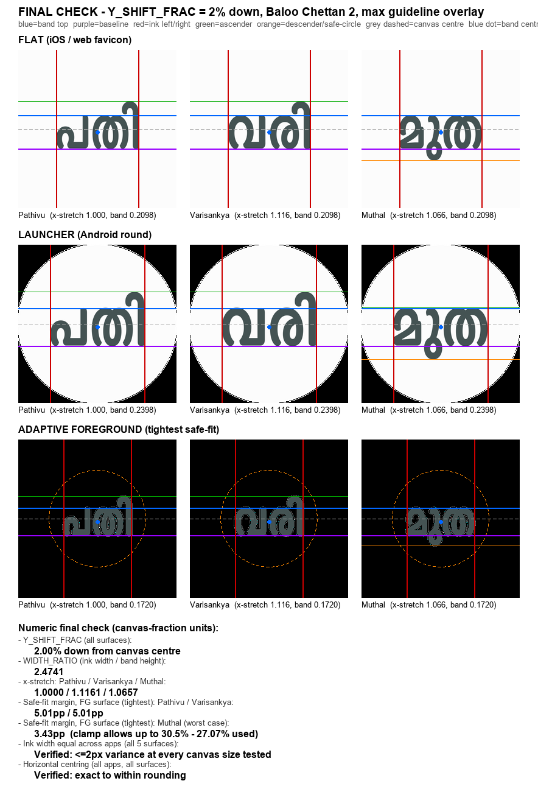

# App icon & brand mark — Hora-family standard (Baloo Chettan 2 wordmark)

Every Hora app's icon and every wide brand card is its short name as a Malayalam
**wordmark** — Pathivu **പതി**, Varisankya **വരി**, Muthal **മുത** — set in **Baloo
Chettan 2** (the rounded family font, OFL), slate `#445353` on near-white `#FCFCFC`,
laid out under the **v3 six-line geometry** below so every app's mark is identically
sized, positioned, and wide.

This is the **single source of truth + generator** for ALL icons AND all wide brand
cards across the family, on every platform and every surface — no exceptions, no
hand-authored one-offs, no unbranded platform default anywhere. One engine, one look.
See `conventions.md` → "Brand mark standard" for the full enumerated list of every
surface this covers and the strict MUST rule behind it.

## The standard (v3 geometry locked 2026-07-03, signed off by the owner)
- **Font:** Baloo Chettan 2, weight **700** (`fonts/BalooChettan2-700.ttf`, OFL — see `fonts/OFL.txt`).
- **Wordmark:** the app's short Malayalam name, shaped with harfbuzz (correct ligatures/positioning).
- **Proportions:** **+45% vertical stretch** (`YSTRETCH=1.45`), plus the per-app **horizontal
  stretch** required by the width rule below (Pathivu 1.0 — the reference; Varisankya 1.116;
  Muthal 1.066).
- **Geometry — the six-line rule (locked 2026-07-03; Y-shift added 2026-07-04):** four
  guides are **family invariants** (identical in every app, on every surface); two are
  per-app:
  1. **Fixed letter size** — the *base-letter band* (the ink band of a plain base consonant,
     പ/മ/വ/ത — they share one band in this font) renders exactly `BAND_FRAC × canvas` high.
  2. **Fixed position** — the band's centre sits `Y_SHIFT_FRAC` (**2%**) of canvas
     **below** the canvas centre, so **band top** and **baseline** land at the same
     (shifted) y in every icon. Tuning history: 0% (dead-centre) read as too high; 4%
     over-corrected — with one shared line across every app, Muthal (descender-only)
     sank visibly while the two ascender-only apps looked right at that value. A
     family-fair check (centroid-centring each app, then averaging/minimax across all
     three) converges to ~0–0.3%, proving no uniform shift can optically satisfy an
     ascender-heavy and a descender-heavy app at once. **2% down** was the final call
     after side-by-side review — perceptibly off dead-centre without Muthal sinking,
     worst-case 3.43 percentage points of margin under the tightest safe-fit clamp (FG,
     which allows up to 7.16% before tripping — the other four surfaces allow far more).
  3. **Fixed width** — ink width = `WIDTH_RATIO (2.4741) × band height`; each wordmark is
     x-stretched to it and centred, so **ink left/right** land at the same x in every icon.
     (Letter-spacing was evaluated and rejected: with one letter-gap per wordmark it triples
     Varisankya's gap. X-stretch is the same anisotropic family move as `YSTRETCH`.)
  4. **Natural extenders** — vowel signs (ി ascender / ു descender) extend freely beyond the
     band; the ascender-top and descender-bottom lines are the two per-app guides.
  5. **Safe-fit** — the FULL ink must fit each surface's safe circle (adaptive `0.305`,
     maskable `0.40`). The family constants carry verified headroom; the engine warns loudly
     if a wordmark would ever trip the clamp (that means: revisit the constants family-wide,
     never ship an off-standard icon).

  

  Per-surface band sizes (`BAND_FRAC`, calibrated so Pathivu's shipped icons are unchanged
  from the previous circle rule): Play 512 `0.2867` · flat squares (iOS AppIcon, web
  favicon/PWA "any") `0.2098` · Android legacy+round launcher `0.2398` · adaptive
  foreground + monochrome `0.1720` · maskable web `0.1678`.
- **Colours:** slate `#445353`, background `#FCFCFC`.
- **Rendering:** **FreeType** (the font's own nonzero rasteriser) — so self-intersecting Malayalam
  strokes (e.g. ത) fill correctly with **no holes**, and edges are crisp.

## The engine — `gen_launcher_icon.py`
Generates **every** icon and wide brand card for an app from the one spec:
- Android launcher: `mipmap-*/ic_launcher_foreground.png` (all densities), `drawable-nodpi/ic_launcher_monochrome.png`, legacy `ic_launcher.png` + `ic_launcher_round.png`.
- Android notification: `drawable/ic_notification.xml` (a solid disc with the app's initial in Baloo Chettan 2 knocked out — `notification_icon('പ', …)`).
- iOS: `AppIcon-1024.png`. Web: `app/icon.png`, `public/{apple-touch-icon,icon-192,icon-512,icon-maskable-512}.png`, `app/opengraph-image.png`. Play: `play_icon_512.png` + `play_feature_graphic.png`. Repo root: `github_social_preview.png`. (The last three are written outside `res/`; `play_feature_graphic.png` and `github_social_preview.png` upload to the listing/repo settings manually — see `hora-play-store` and "GitHub repo social preview" below.)

Run (Pathivu is the reference consumer):
```
pip install uharfbuzz freetype-py fonttools brotli numpy pillow
python gen_launcher_icon.py pathivu      # or:  python gen_launcher_icon.py varisankya
```
Per-app config (text, initial letter, repo path, iOS module dir, **English name +
tagline**) is the `APPS` dict in the script.
**Varisankya's agent** adds/uses its config and runs `… varisankya` to adopt the standard — same algorithm, same look.

## Wide brand cards — one composer, four surfaces
`_wide_card(text, name_en, tagline_en, out_path, w, h)` is the **one** composer behind
every "glyph + Latin name + tagline" surface the family ships — never a re-tuned
one-off per surface. The Malayalam wordmark (via `render()`, so it carries the band
rule + Y-shift verbatim) sits on the left; the Latin `name_en` (bold) + one-line
`tagline_en` (regular) to its right, both in **Google Sans Flex at `'ROND'` maxed to
100** (`fonts/` ships the icon face; the variable font lives at
`shared/android/res/font/google_sans_flex_variable.ttf` and is loaded from there — see
"Marketing & static-image typography" in `conventions.md`); a slate accent bar on the
right edge. Every metric (margins, gaps, accent width) scales proportionally with the
requested height from a reference tuning at 500px — so a narrower-aspect card (the OG
image, the GitHub preview) is still the same design, not a re-tuned one-off. The text
column **shrinks to fit**: the *start* size scales with the card, but the *floor* is a
fixed, absolute pixel legibility limit (never scaled up) — narrower-aspect cards need
the full shrink range to fit Varisankya's tagline (the longest in the family) without
raising. A tagline that still doesn't fit even at the floor **raises** rather than
shipping a clipped asset — shorten the copy, don't widen the column.

Three thin wrappers call it at different fixed sizes:
- **`feature_graphic()`** — Play Store feature graphic, 1024×500. Upload to the Play
  listing manually (the Play listing API doesn't accept graphics reliably on fresh
  apps — see `hora-play-store`).
- **`og_image()`** — Next.js Open Graph / Twitter social-share image, 1200×630, written
  to `web/app/opengraph-image.png`. Next.js's special-file convention auto-injects the
  `og:image`/`twitter:image` meta tags — **no manual step, no code change** in the app.
  Closes a real gap: before this, sharing a link to any family web app showed no
  preview image at all.
- **`github_social_preview()`** — GitHub repository social-preview card, 1280×640
  (GitHub's recommended size), written to `<repo root>/github_social_preview.png`.
  **GitHub has no API for this** — upload by hand: repo **Settings → General → Social
  preview → Edit → upload image**. Closes a real gap: every family repo previously
  showed GitHub's generic auto-generated card (repo name + the **owner's personal
  avatar photo** + stats), confirmed by fetching each repo's `opengraph-image` endpoint
  before this stood as a standard.

**`family_social_preview()`** is hora-core's own variant — not one app's wordmark but
every app currently in `APPS` rendered side by side, since this repo is the shared
foundation under all three apps, not a consumer app itself. It updates automatically
the day a new sibling is added to `APPS`. Also uploaded by hand to hora-core's own repo
settings.

Full design-language conventions for the Play listing specifically (screenshots,
title/description copy) are in `conventions.md` → "Play Store listing copy &
screenshots". The full enumerated list of every surface (icons + wide cards) is
`conventions.md` → "Brand mark standard".

## Notification icon — same standard, same engine
The notification-shade icon is **a solid white disc with the app's Malayalam initial
knocked out as a hollow**, drawn as a single `evenOdd` vector path (disc *minus* glyph)
in `drawable/ic_notification.xml`. The art is white-on-transparent — Android tints the
small icon itself (white in the status bar, themed in the shade), so no colour decision
belongs in the file. The engine emits it via `notification_icon(<initial>, …)` from the
**same Baloo Chettan 2** glyph as the launcher, **vertically stretched the same 1.45×**
(`YSTRETCH`) so the status-bar initial and the wordmark share one letterform.

This is a firm family standard: **do not** revert to a framed, outlined, or
stroked-glyph treatment. The glyph is a *filled silhouette knocked out of the disc*
(negative space), not a stroked outline. (An earlier family icon used a rounded-square
outline frame around a stroked letter — that is superseded.)

## Reusing for a new sibling app
Add an entry to `APPS` (its Malayalam short name + initial + repo + iOS dir + English
`name_en`/`tagline_en` for the feature graphic) and run it. Nothing else to tune — the
standard (font, weight, stretch, geometry, colours, rasteriser) is fixed here. The engine
computes the new wordmark's x-stretch automatically and **raises** if it falls outside
`[0.98, 1.20]` — that means the wordmark is too narrow/wide for the family width and
revisiting `WIDTH_RATIO` is a deliberate family decision (all apps regen together), never
a silent per-app tweak. Every `_wide_card()`-based surface (`feature_graphic()`,
`og_image()`, `github_social_preview()`) similarly raises if `tagline_en` doesn't fit its
column even at the smallest allowed size — shorten the tagline, don't widen the column.
Adding a sibling also updates hora-core's own `family_social_preview()` automatically
(it renders every entry currently in `APPS`) — regenerate and re-upload it too so the
family lockup includes the new app.

## Legacy
`varisankya-vari-reference.xml/.png` are the **old** hand-authored "വരി" vector (the prior gold
standard) kept for history. The previous per-app raster pipeline (`_tools/match_icon.py` +
`gen_icons.py`) and the earlier standalone notification-icon generator are **superseded** by
this single engine.
